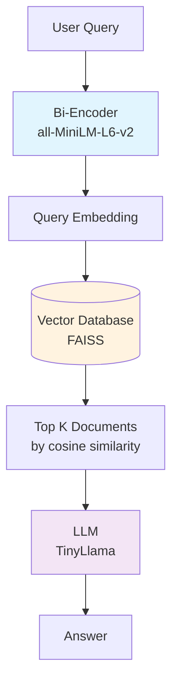
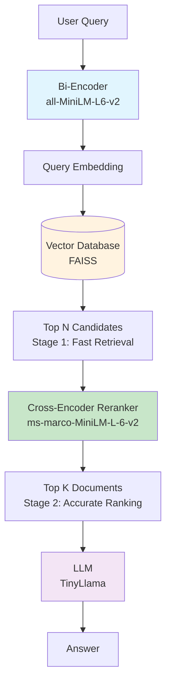
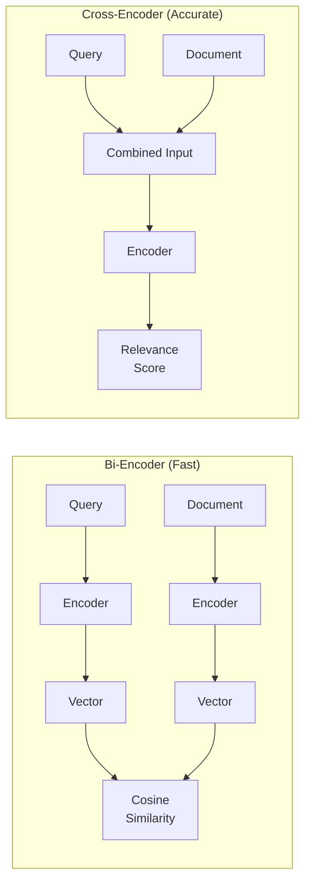

# RAG Reranking Experiment

This experiment demonstrates how **reranking** improves retrieval quality in RAG (Retrieval-Augmented Generation) systems.

## Architecture Comparison

### RAG Without Reranking (Single-Stage)



**How it works:**
1. Query is encoded into a vector using bi-encoder
2. Vector search finds documents with similar embeddings
3. Top K documents go directly to LLM
4. LLM generates answer

**Limitation:** Documents with high keyword overlap may rank higher than documents that actually answer the question.

---

### RAG With Reranking (Two-Stage)



**How it works:**
1. Query is encoded into a vector using bi-encoder
2. Vector search retrieves top N candidates (fast, approximate)
3. Cross-encoder evaluates each (query, document) pair together
4. Documents are reranked by relevance score
5. Top K reranked documents go to LLM
6. LLM generates answer

**Advantage:** Cross-encoder understands if a document actually *answers* the question, not just matches keywords.

---

## Key Differences

| Aspect | Without Reranking | With Reranking |
|--------|------------------|----------------|
| **Stages** | 1 (embedding only) | 2 (embedding + cross-encoder) |
| **Speed** | Faster | Slower (extra scoring step) |
| **Accuracy** | Good for topic matching | Better for question answering |
| **Scoring** | Query & doc encoded separately | Query & doc evaluated together |
| **Best for** | Large-scale retrieval | Precision-critical applications |

---

## How Bi-Encoder vs Cross-Encoder Work



- **Bi-Encoder:** Encodes query and document separately, compares vectors
- **Cross-Encoder:** Encodes query and document together, directly outputs relevance

---

## Models Used

| Component | Model | Purpose |
|-----------|-------|---------|
| Embedder | `all-MiniLM-L6-v2` | Fast document/query encoding |
| Reranker | `ms-marco-MiniLM-L-6-v2` | Accurate relevance scoring |
| LLM | `TinyLlama-1.1B-Chat` | Answer generation |

All models run locally on CPU - no API keys required.

---

## Running the Experiment

```bash
# From project root
uv sync
uv run jupyter lab experiments/rag/rag_reranking_comparison.ipynb
```

Or run directly:
```bash
uv run python -c "exec(open('experiments/rag/run_notebook.py').read())"
```

---

## Results Summary

In our demo with vegetarian protein articles:

| Metric | Without Reranking | With Reranking |
|--------|------------------|----------------|
| **Top 1 Result** | TRAP (general discussion) | USEFUL (specific foods) |
| **Rerank Score** | -4.03 | +0.93 |
| **LLM Answer** | Vague, generic | Specific: "Lentils 18g, Tofu 20g..." |

The cross-encoder correctly identifies that a document listing specific foods with protein amounts is more relevant than a document that merely discusses vegetarian protein as a topic.
